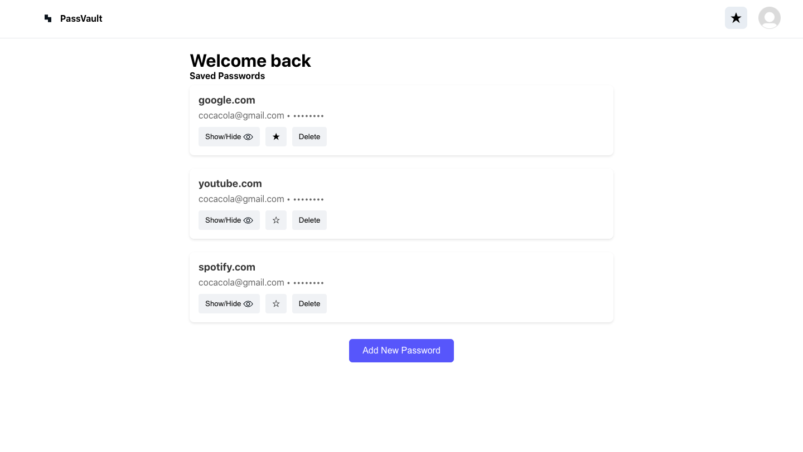
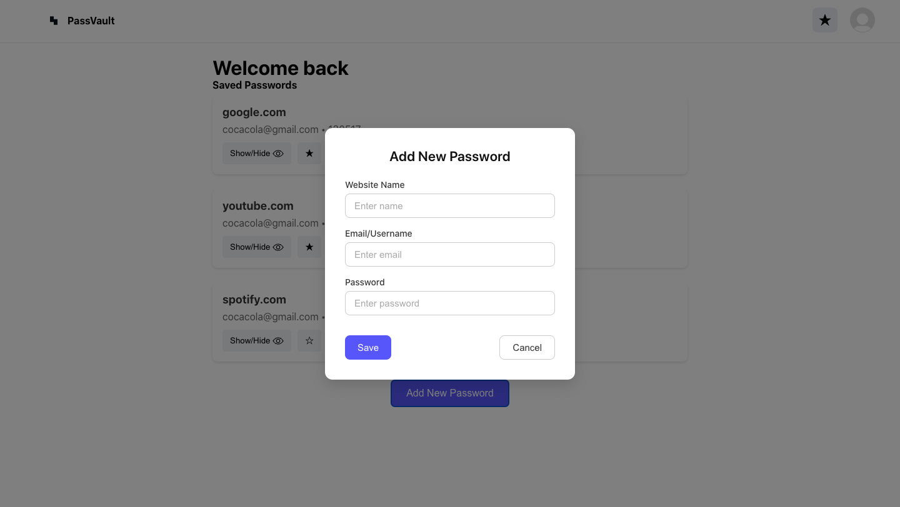
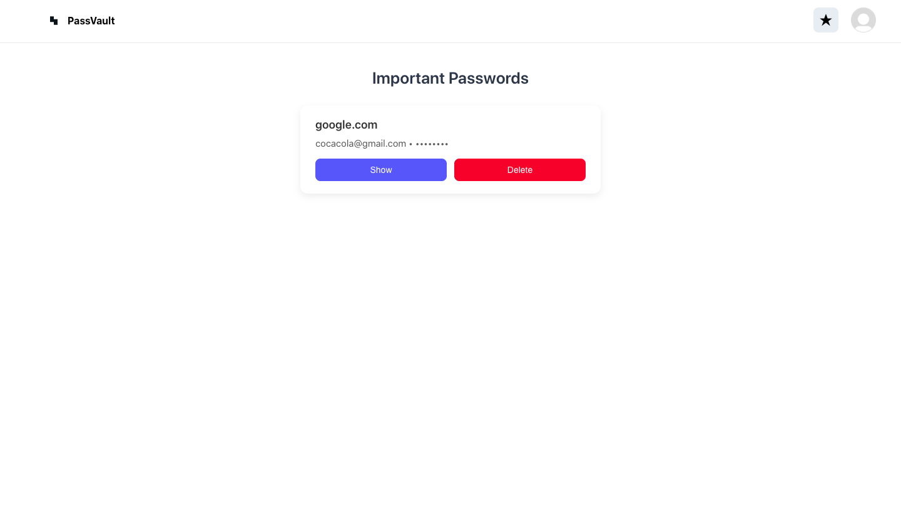
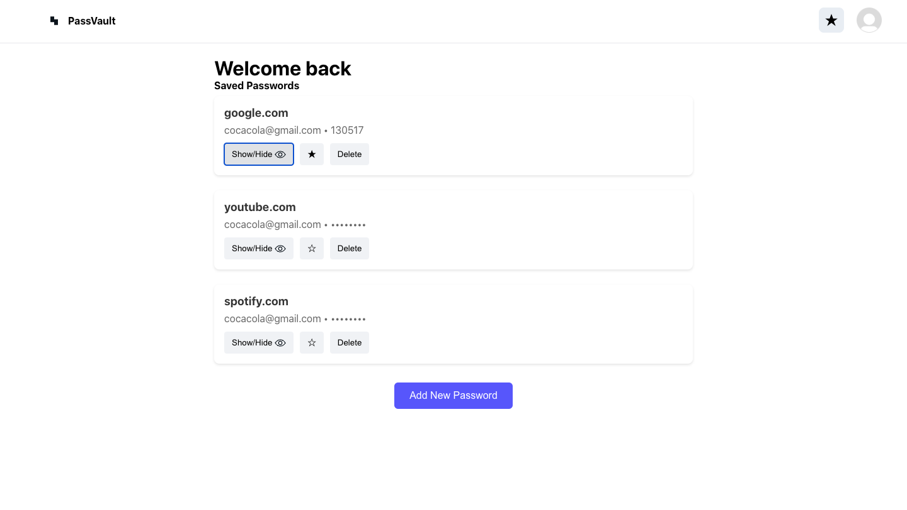

# 🔐 Password Manager

A simple and responsive password manager built with **React** and **SCSS**, designed to securely store and manage your passwords locally in the browser.


## 🚀 Features

- ✅ Add, edit, and delete saved passwords  
- ⭐ Mark passwords as important  
- 🙈 Toggle password visibility (show/hide)  
- 💾 LocalStorage support – data saved locally  
- 🔐 Basic registration screen (no backend required)  
- 📱 Responsive design (mobile-ready)  
- 🧼 Clean and minimal UI

## 📦 Tech Stack

- **React** (with hooks)
- **SCSS** for styling
- **LocalStorage** for persistence
- **React Router** (if navigation is added)

## 📸 Screenshots

| Main Page | Add Password | Important Passwords | ShowHide Passwords |
|-----------|---------------|---------------------|
|  |  |  | 

## 🔧 Installation

```bash
git clone https://github.com/MambaXan/Password-Manager
cd password-manager
npm install
npm start
